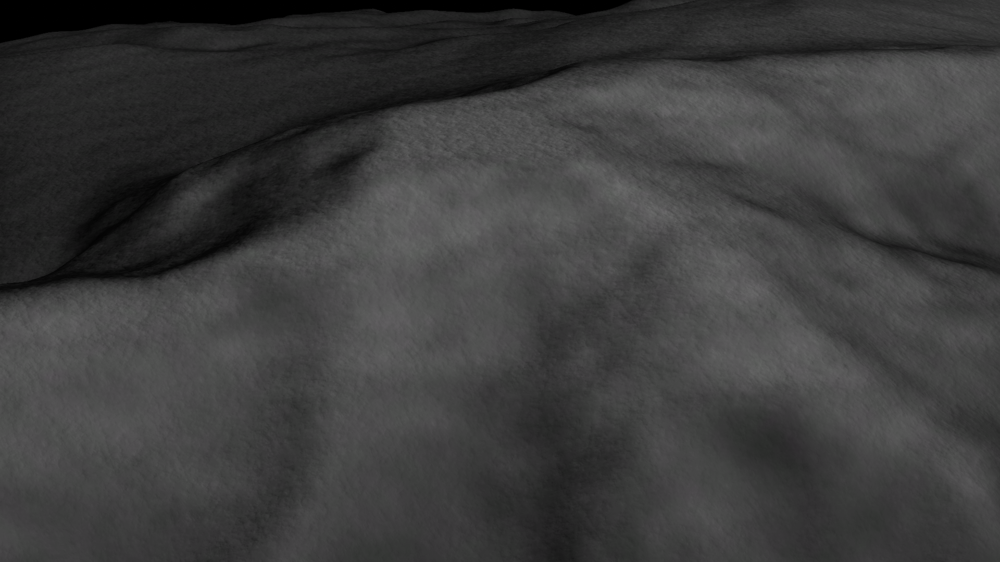
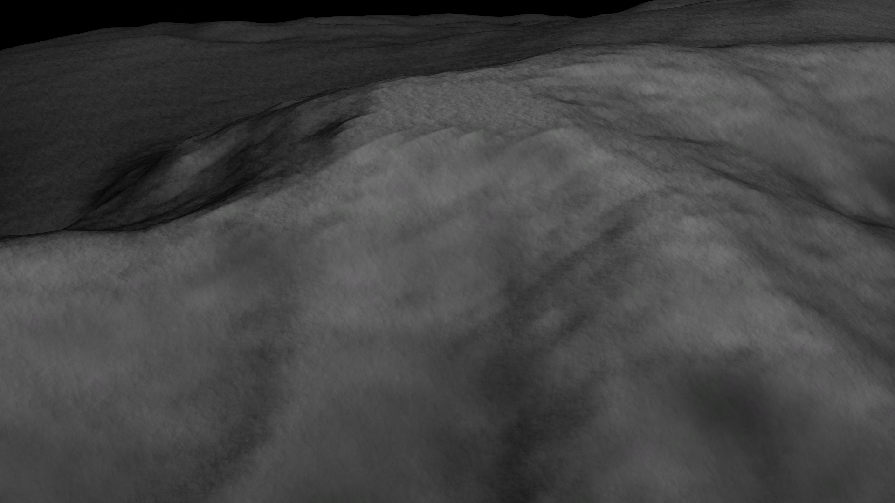

# Better Heightmap Algorithm for Kerbal Space Program


Mod for Kerbal Space Program that adds a custom PQS Mod which implements a variant of ``VertexHeightMap`` using _Mitchell-Netravali Filtering_ instead of _Bilineal Filtering_.

This reduces the amount of _pixelization_ at cliffs and other decently-detailed areas of a heightmap.

This mod still requires testing (Just in case), so use it with caution.

---

## Usage

With a compiled .dll file inside the ``GameData``, you can use the ``VertexMitchellNetravaliHeightMap`` PQS Mod in Kopernicus Configuration Files.

The PQSs mod also contains two new parameters: ``B`` and ``C``. These control what type of filtering is done. Values ``B = 1/3, C = 1/3`` and ``B = 1, C = 0`` have been tested and yield decent results.

Here you can see a table that roughly describes the results you might expect with specific ``B`` and ``C`` values:


An example of a ``VertexMitchellNetravaliHeightMap`` node:

```default
VertexMitchellNetravaliHeightMap
{
	map = 000_TESTING/PluginData/Niko_height.png
	offset = -1920
	deformity = 7100
	scaleDeformityByRadius = false
	order = 1
	enabled = true

	B = 0.33333333
	C = 0.33333333
}
```

---
---

## Comparison

_VertexMitchellNetravaliHeightMap, B = 1, C = 0_



_VertexHeightMap, Stock_



---
---

## Compilation

Make sure all .dll paths at ``VertexBilinealHeightMap/VertexBilinealHeightMap.csproj`` are correct, then run either the Makefile provided or ``dotnet build --configuration Release -o bin``.

---
---


## Mathematics

Taked from [Wikipedia](https://en.wikipedia.org/wiki/Mitchell%E2%80%93Netravali_filters), using _Mitchell_'s and _Netravali_'s cubic alternate resampling formula:


